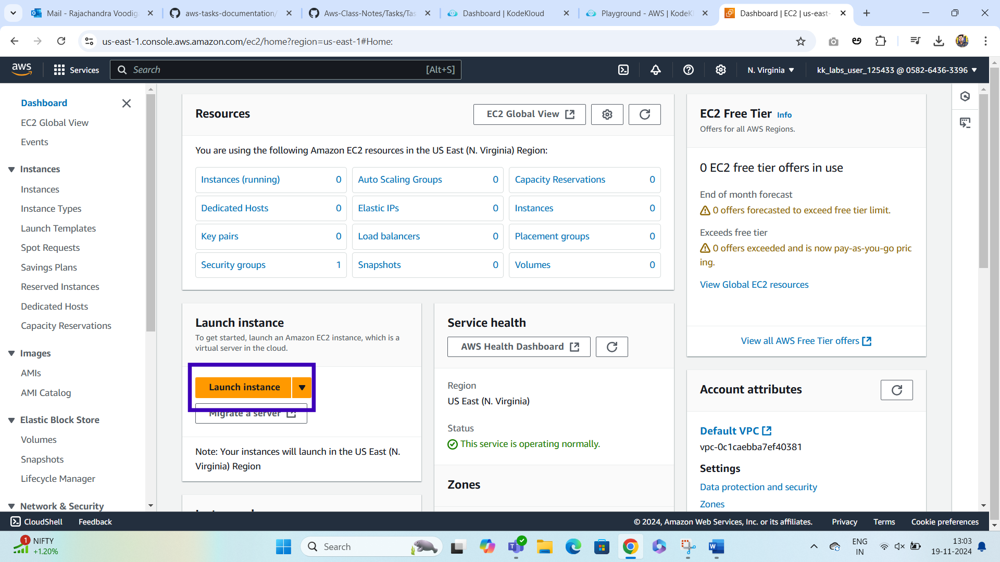
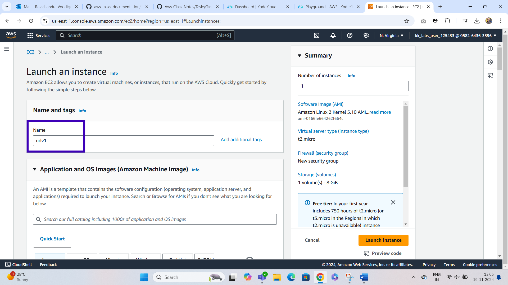
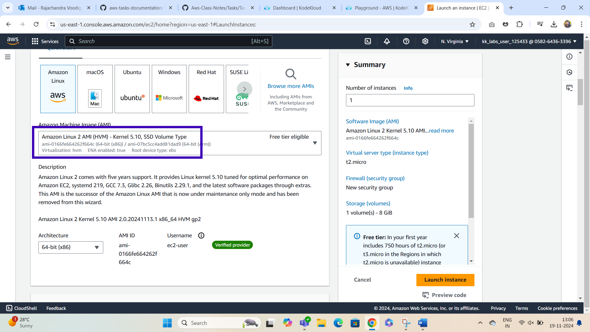
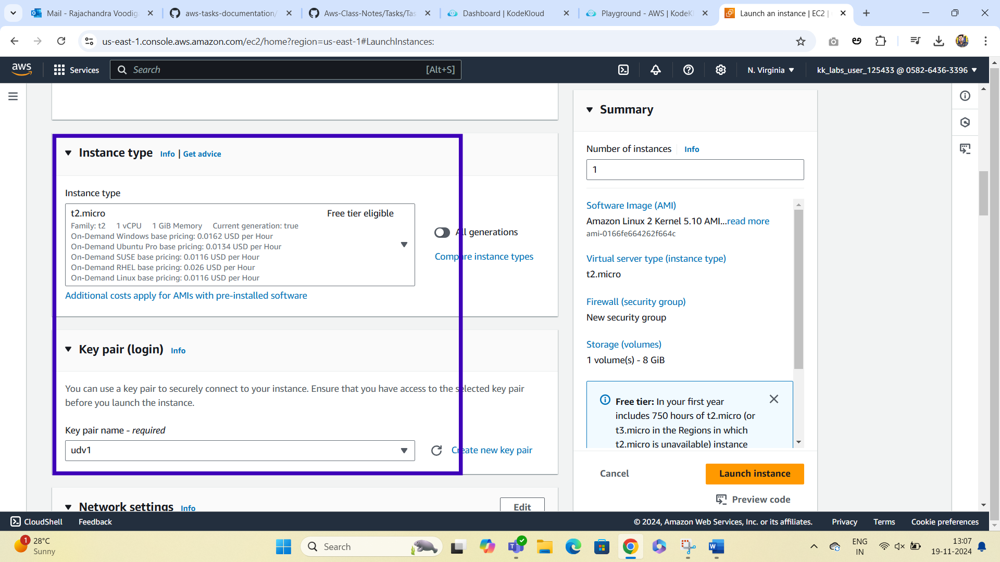
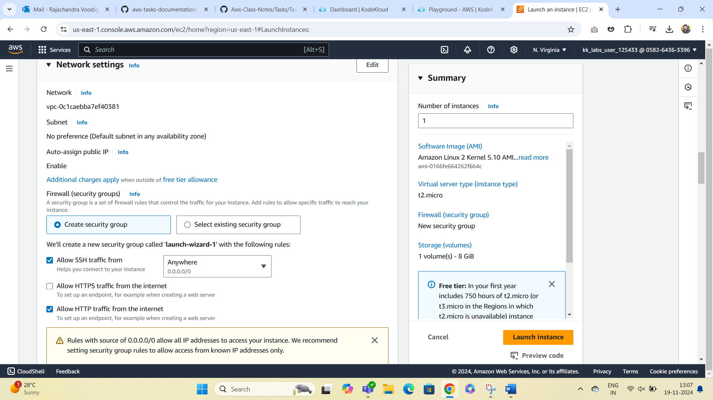
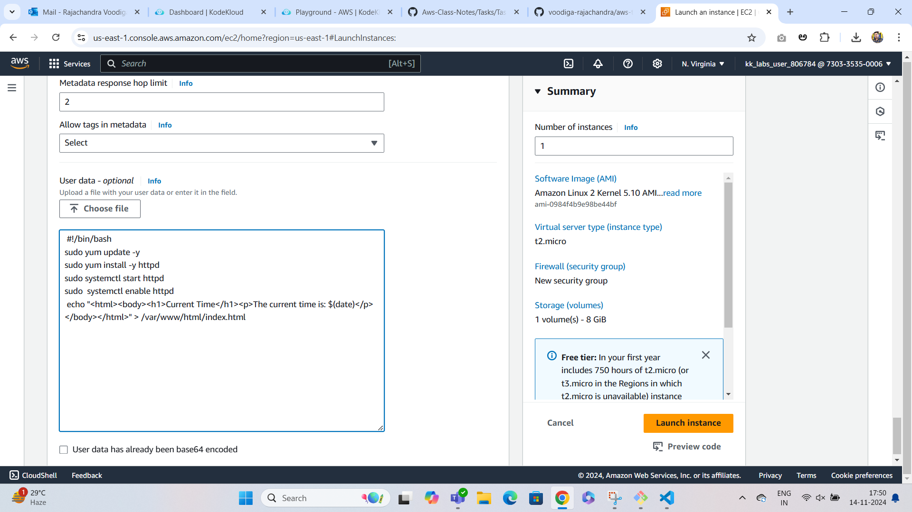
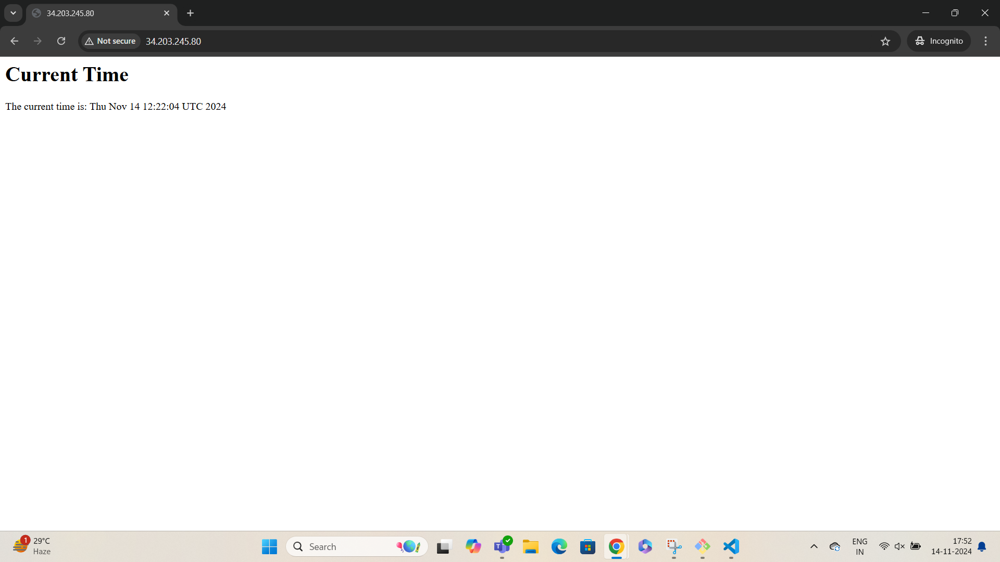

# Project Overview: Real-Time Web Application with User Data
***

**In this project, we will launch an EC2 instance that automatically installs and configures a simple web application using a User Data script. This application will serve a webpage that displays real-time data, such as the current time.**

### Step 1: Create an EC2 Instance with User Data
***

### Step 2: Access Your Application
***
