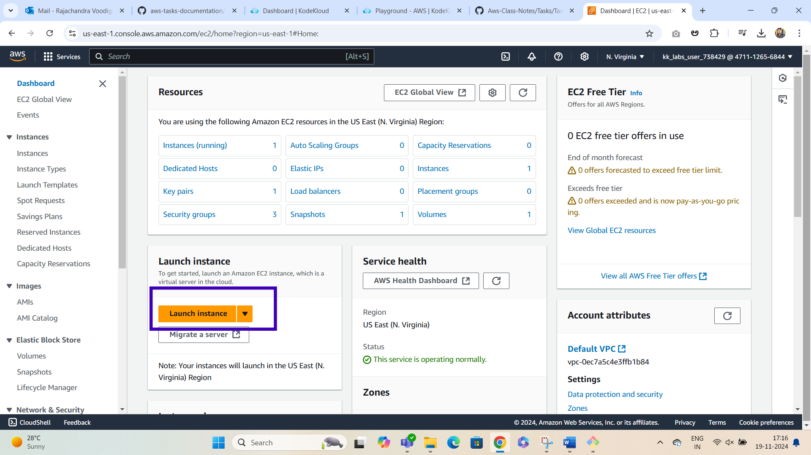
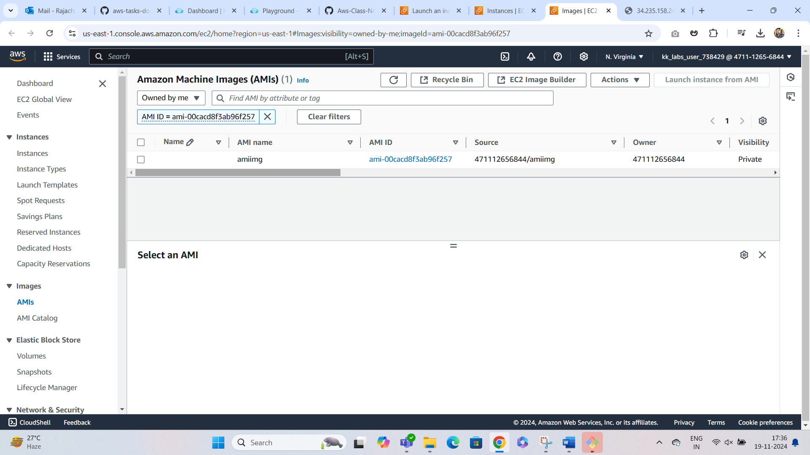

# Project Overview: Real-Time Python Web Application Using AWS AMI
***

**In this project, we will set up a simple Flask application that displays the current server time.We will create a custom AMI after the setup so that the application can be easily replicated.**

### Step 1: Create and Configure an EC2 Instance
***

### Step 2: SSH into Your EC2 Instance

### Step 3: Develop the Flask Application
***

### Step 4: Run the Application

### Step 6: Create a Custom AMI

