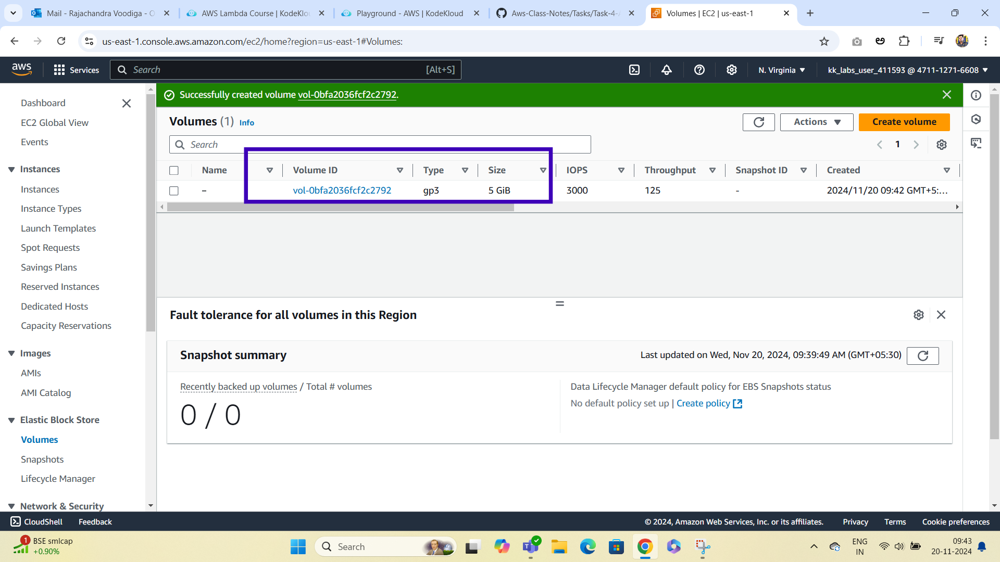

# Creating a real-time application that uses AWS Elastic Block Store (EBS) 
***
**volumes involves integrating the EBS with a running application on an EC2 instance,typically managed through Elastic Beanstalk (EBS).Here's a guide to set up a simple application that utilizes EBS for storage and can perform real-time tasks.**

### Step 1: Create and Attach an EBS Volume
***

### Step 2: Set Up Your Node.js Application
***

