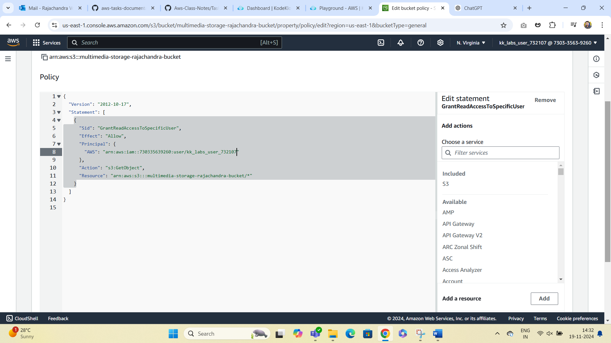
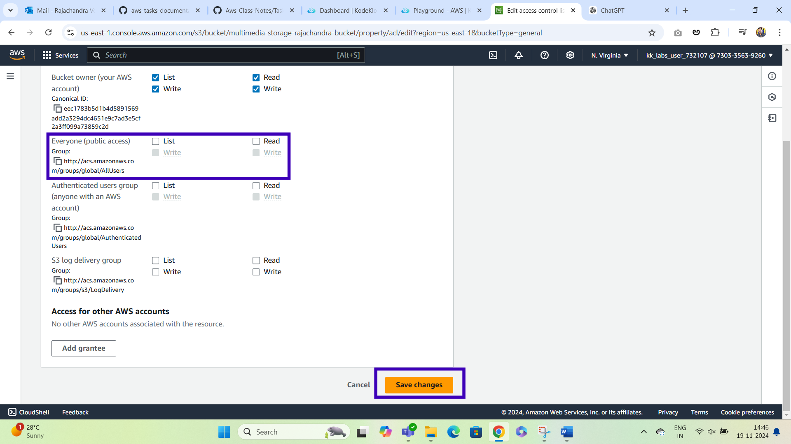

# Simple Storage Service(s3)
***
**Participants will create an S3-based solution to store, organize, manage, and archive multimedia content (e.g., images, videos, documents). They’ll learn to set up bucket configurations, use object versioning, implement lifecycle policies, and enforce security through bucket policies and access controls.**
### Step1:	Create an S3 Bucket with Appropriate Naming and Versioning
***

### Step2:Organize Files Using Prefixes (Folders)
***

### Step3:Implement Lifecycle Policies for Cost Optimization
***

### Step4:Enable Server-Side Encryption
***

### Step5:Configure Access Controls and Bucket Policies
***

### Step6:Set Up S3 Event Notifications for File Management Automation
***

